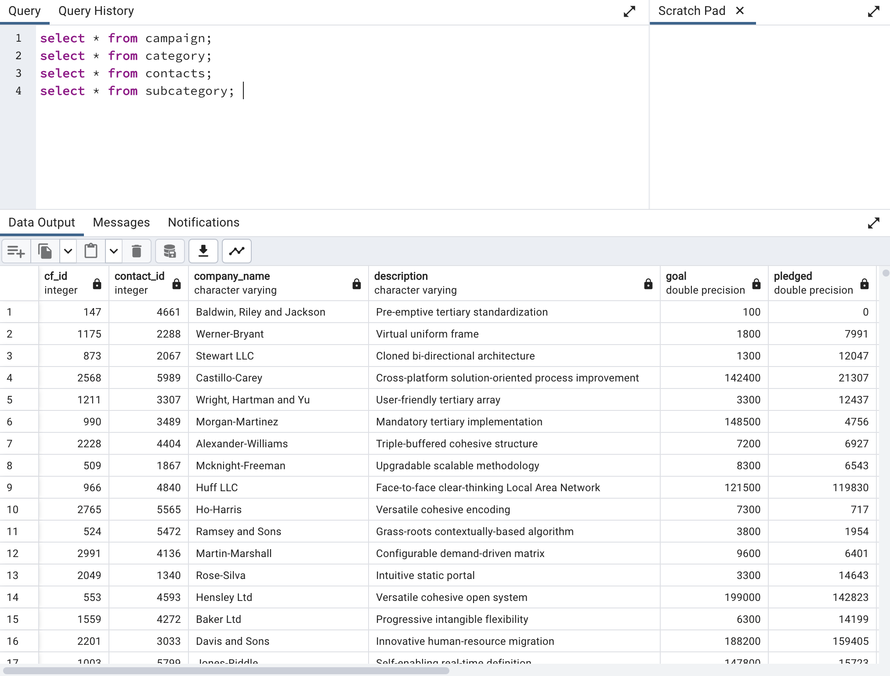
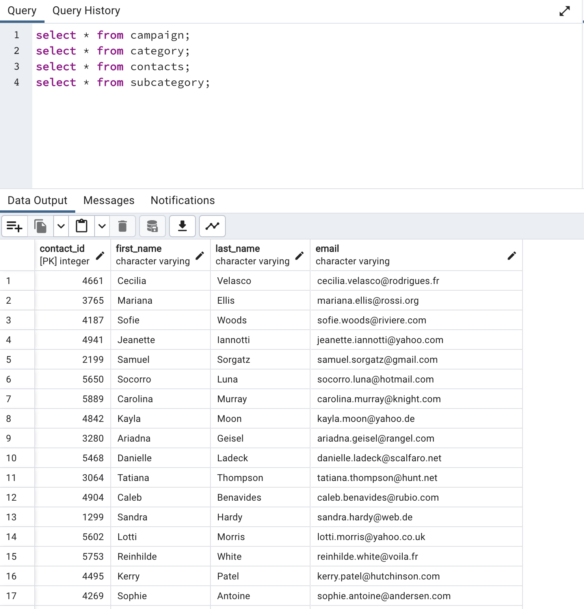
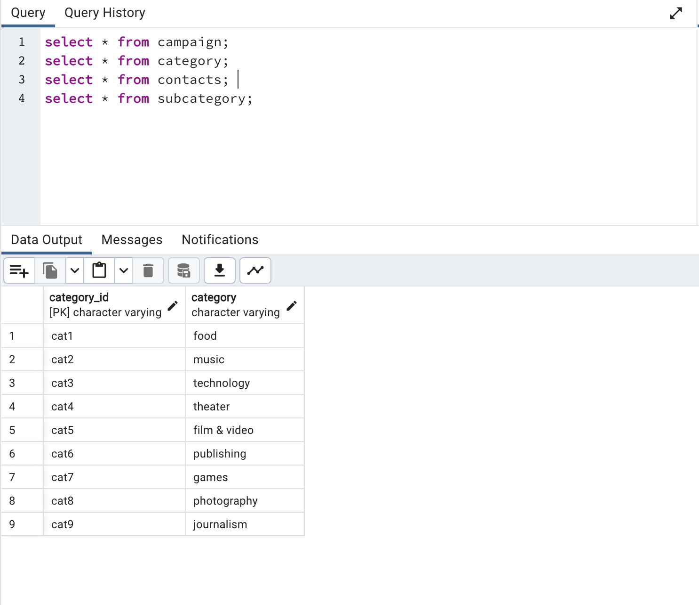
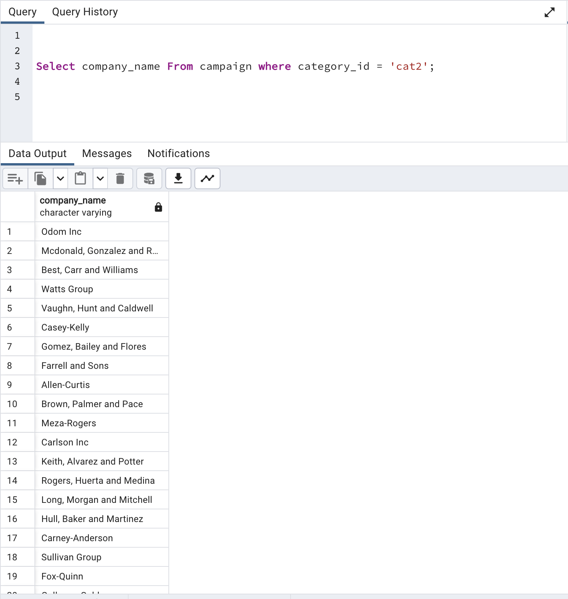
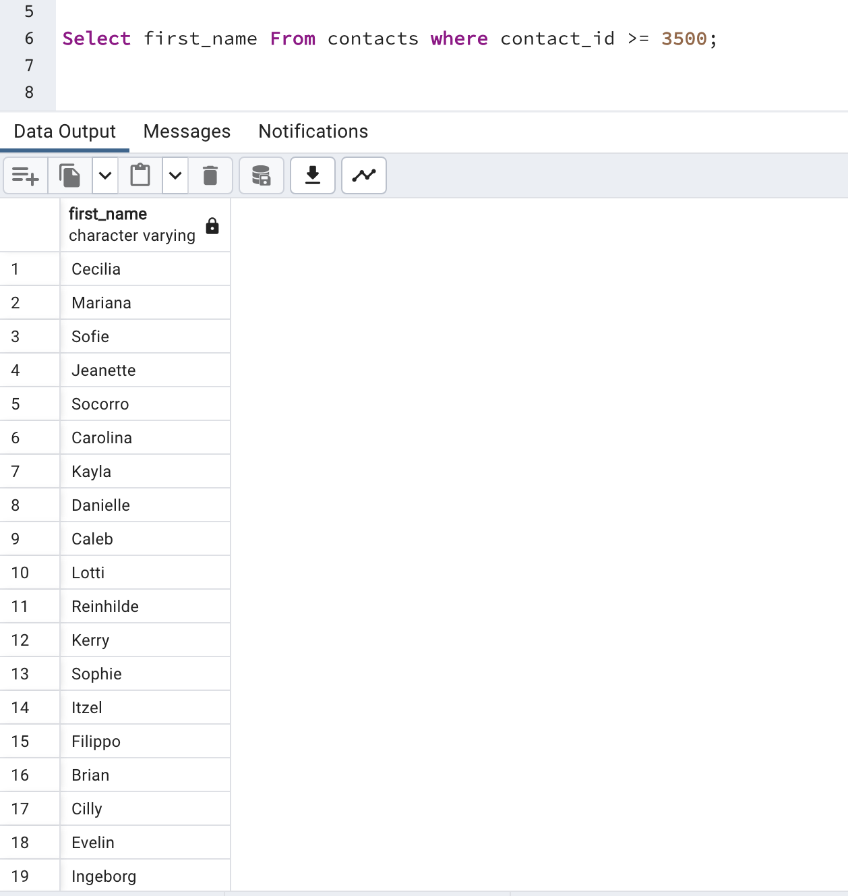
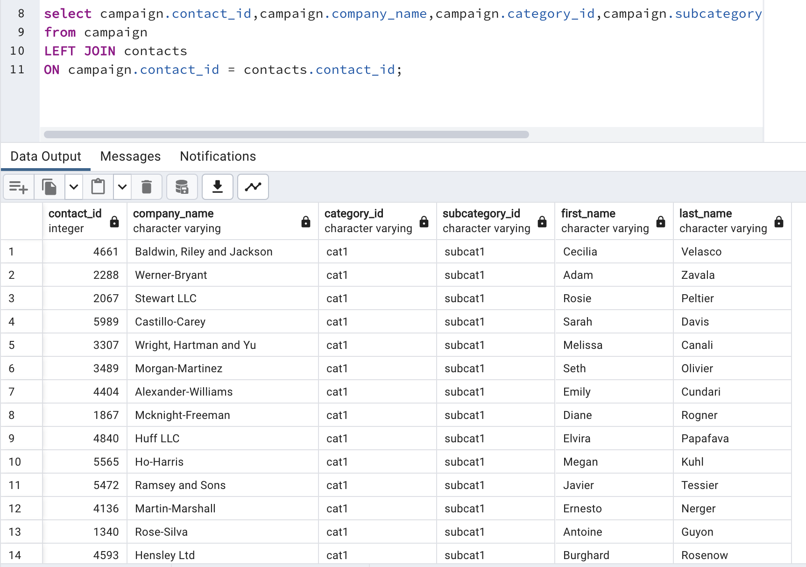

# Project 2 Crowdfunding_ETL

## Collaborators
- Dalya Lami
- Dayana Imanova

## Table of Contents

- [About](#about)
- [Getting Started](#getting-started)
- [Data Transformation](#data-transformation)
- [Screenshots](#screenshots)

## About
### Background
For the ETL mini project, you will work with a partner to practice building an ETL pipeline using Python, Pandas, and either Python dictionary methods or regular expressions to extract and transform the data. After you transform the data, you'll create four CSV files and use the CSV file data to create an ERD and a table schema. Finally, you’ll upload the CSV file data into a Postgres database.

### The instructions for this mini project are divided into the following subsections:

* Create the Category and Subcategory DataFrames
* Create the Campaign DataFrame
* Create the Contacts DataFrame
* Create the Crowdfunding Database

## Getting started

### Prerequisites
Before you begin, ensure you have the following installed:
- Jupiter Notebook
- pgAdmin4
- Pandas

### Installing

Install the necessary applications and download the module files. You can find the data files and code in the Project 2 Challenge files folder.

## Data Transformation

### Create the Category and Subcategory DataFrames
1) Extract and transform the crowdfunding.xlsx Excel data to create a category DataFrame that has the following columns:
 * A "category_id" column that has entries going sequentially from "cat1" to "catn", where n is the number of unique categories
 * A "category" column that contains only the category titles
2) Export the category DataFrame as category.csv and save it to your GitHub repository.
3) Extract and transform the crowdfunding.xlsx Excel data to create a subcategory DataFrame that has the following columns:
 * A "subcategory_id" column that has entries going sequentially from "subcat1" to "subcatn", where n is the number of unique subcategories
 * A "subcategory" column that contains only the subcategory titles
4) Export the subcategory DataFrame as subcategory.csv and save it to your GitHub repository.

### Create the Campaign DataFrame
1) Extract and transform the crowdfunding.xlsx Excel data to create a campaign DataFrame has the following columns:
 * The "cf_id" column
 * The "contact_id" column
 * The "company_name" column
 * The "blurb" column, renamed to "description"
 * The "goal" column, converted to the float data type
 * The "pledged" column, converted to the float data type
 * The "outcome" column
 * The "backers_count" column
 * The "country" column
 * The "currency" column
 * The "launched_at" column, renamed to "launch_date" and with the UTC times converted to the datetime format
 * The "deadline" column, renamed to "end_date" and with the UTC times converted to the datetime format
 * The "category_id" column, with unique identification numbers matching those in the "category_id" column of the category DataFrame
 * The "subcategory_id" column, with the unique identification numbers matching those in the "subcategory_id" column of the subcategory DataFrame
2) Export the campaign DataFrame as campaign.csv and save it to your GitHub repository.

### Create the Contacts DataFrame
#### Use Python dictionary methods.
* Import the contacts.xlsx file into a DataFrame.
* Iterate through the DataFrame, converting each row to a dictionary.
* Iterate through each dictionary, doing the following:
 * Extract the dictionary values from the keys by using a Python list comprehension.
 * Add the values for each row to a new list.
* Create a new DataFrame that contains the extracted data.
* Split each "name" column value into a first and last name, and place each in a new column.
* Clean and export the DataFrame as contacts.csv and save it to your GitHub repository.

   
## Screenshots

### Campaign Table

### Contacts Table

### Category Table

### Subcategory Table

### Queries

